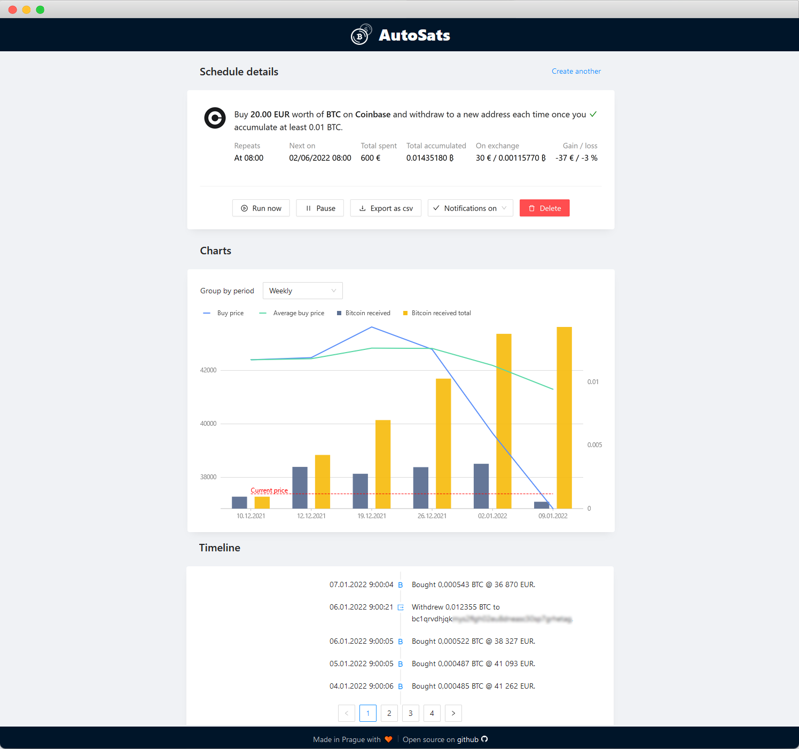

# AutoSats

[](https://github.com/bezysoftware/autosats/actions)


AutoSats is the simplest non-custudial DCA solution you can run on your own node. It lets you periodically buy Bitcoin on exchanges and withdraw it to your own wallet. 



## What is DCA?

> Dollar-cost averaging (DCA) is an investment strategy in which an investor divides up the total amount to be invested across periodic purchases of a target asset in an effort to reduce the impact of volatility on the overall purchase. The purchases occur regardless of the asset's price and at regular intervals.
[Source](https://www.investopedia.com/terms/d/dollarcostaveraging.asp).

## Supported exchanges

* Bitfinex
* Bitstamp
* Coibase PRO
* Poloniex
* ...more coming in the future, see below how you can contribute

## Installation

AutoSats can be run in a Docker container. See how to [install docker](https://docs.docker.com/engine/install/).

Latest images which are built from the `main` branch are published to [Github Container Repository](https://github.com/bezysoftware/autosats/pkgs/container/autosats) and can be run using

```bash
docker run -e Bitcoin__Auth=username:password -e Bitcoin__Url="http://host.docker.internal:8332" -p 8080:80 ghcr.io/bezysoftware/autosats:latest
```

Make sure you:
1) Set your RPC username & password to your running bitcoind instance (needed for withdrawals)
2) Set bitcoind url, in this sample it assumes it runs on the host

AutoSats will be accessible on http://localhost:8080

Released version will be tagged and published to Dockerhub. The long term goal is to make AutoSats available on [Umbrel](https://getumbrel.com/) and similar solutions.

## Contributing

AutoSats is in active development and help is certainly welcome. 
Currently it will be mostly needed to cover more exchanges. 
If you want to help to add your favorite exchange:

1) Make sure it's supported by [ExchangeSharp](https://github.com/jjxtra/ExchangeSharp/) (if not then first raise a PR there)
2) Test a schedule (including withdrawal) for your new exchange and create a PR. See this [sample Bitfinex PR](https://github.com/bezysoftware/autosats/pull/1)
3) Attach screenshots from the exchange history screen showing the purchase and withdrawal